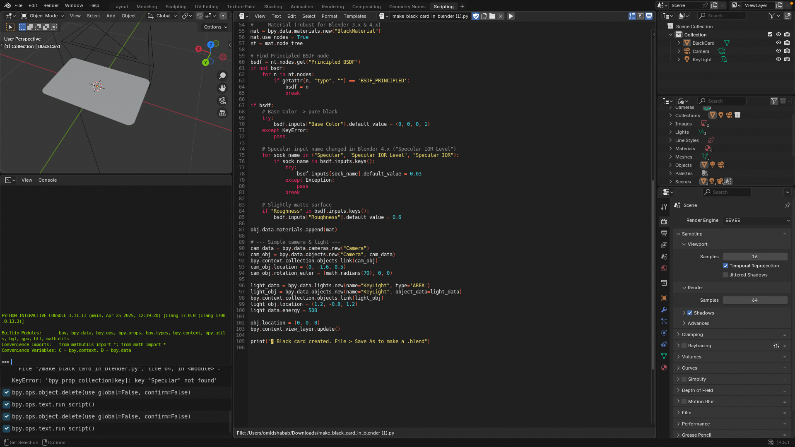

# Black Rounded Card (iOS‑style corners) — Blender Script & Model



This repository contains a simple **Blender Python script** that generates a **black rounded‑rectangle “card”** with iOS‑like corner radius and a tiny camera/light setup. It also ships with an **OBJ+MTL** model so you can import the mesh without running any Python.

## What you get
- `make_black_card_in_blender.py` — run inside Blender to generate the card procedurally.
- `black_card_ios_round.obj` / `black_card_ios_round.mtl` — importable model with a black material.
- (Optional) `README_BlackCard.md` — this file.

**Supported Blender:** 3.x and 4.x (script handles the Principled BSDF specular socket name change).

---

## Quick Start (Script Method)

1. **Open Blender** (Eevee or Cycles; both are fine).  
2. Go to **Scripting** workspace → **Open** → pick `make_black_card_in_blender.py`.  
3. Click **Run Script**.  
4. A new object named **`BlackCard`** appears at the origin with black material, plus a **Camera** and an **Area Light**.  
5. **File → Save As…** to save a `.blend` file.

> Tip: Switch the 3D Viewport to **Rendered** mode to preview lighting and material.

### Exporting the Output
- **To .blend:** `File → Save As…`  
- **To GLTF/GLB:** `File → Export → glTF 2.0 (.glb/.gltf)`  
- **To FBX:** `File → Export → FBX (.fbx)`  
- **To OBJ:** `File → Export → Wavefront (.obj)`  
  - If needed, apply transforms first: select **BlackCard** → `Ctrl+A` → **Apply All Transforms**.

> The script already sets smooth shading. You can tweak material roughness/specularity in the Shader Editor.

---

## Quick Start (Import OBJ Method)

If you don’t want to run Python:

1. **File → Import → Wavefront (.obj)**  
2. Choose `black_card_ios_round.obj` (ensure `black_card_ios_round.mtl` is in the same folder).  
3. The mesh imports with a black material. Adjust scale/units if needed via **Scene Properties → Units**.

---

## Parameters (edit at the top of the script)

- `w` — width (default `1.0` Blender units)  
- `h` — height (default `0.6`)  
- `r` — corner radius (default `0.06`, about **10% of height** for iOS‑like look)  
- `t` — thickness (default `0.01`)  
- `corner_steps` — smoothness of corner arcs (default `24` per corner)

**Examples**
- **Credit‑card aspect** (85.6×53.98 mm): set scene units to **Metric**, unit scale to **0.001**, then set `w=0.0856`, `h=0.05398`, choose `r` (e.g. `0.004`).  
- **Square app tile:** set `w=h`, pick `r ≈ 0.1*h` for a classic iOS vibe.

---

## Line‑by‑Line Walkthrough of the Script

Below is the entire script with a **comment for every line**, explaining what it does.

```python
import bpy, bmesh, math            # Blender Python API (bpy), mesh editing helpers (bmesh), and math utilities
from mathutils import Vector       # Blender vector type (imported for completeness; not strictly required)

# --- Parameters ---
w = 1.0      # width of the card in Blender units
h = 0.6      # height of the card
r = 0.06     # corner radius; ~10% of height gives an iOS-like feel
t = 0.01     # thickness (extrusion along Z)
corner_steps = 24   # number of segments per 90° arc; higher = smoother corners

# --- Clean scene (optional) ---
for obj in list(bpy.data.objects):              # iterate over existing objects in the file
    obj.select_set(True)                        # select each object
bpy.ops.object.delete(use_global=False, confirm=False)  # delete all selected (safe reset for a demo scene)

# --- Create mesh ---
mesh = bpy.data.meshes.new("BlackCardMesh")     # create a new empty Mesh datablock
obj  = bpy.data.objects.new("BlackCard", mesh)  # create an Object that uses the mesh
bpy.context.collection.objects.link(obj)        # link the object to the current collection so it appears in the scene
bm = bmesh.new()                                # start a new in‑memory BMesh for easy procedural modeling

def arc(cx, cy, start, end, steps):
    """Yield points along an arc centered at (cx,cy) from angle 'start' to 'end'."""
    for i in range(steps + 1):                  # include both ends of the arc
        a = start + (end - start) * (i / steps) # linearly step the angle
        yield (cx + r * math.cos(a),            # convert polar to Cartesian X
               cy + r * math.sin(a))            # and Y using the radius r

# Corner circle centers (clipped inside the rectangle by radius r)
ctr_tr = ( w/2 - r,  h/2 - r)   # top‑right
ctr_tl = (-w/2 + r,  h/2 - r)   # top‑left
ctr_bl = (-w/2 + r, -h/2 + r)   # bottom‑left
ctr_br = ( w/2 - r, -h/2 + r)   # bottom‑right

# Build a counter‑clockwise 2D outline made of 4 quarter‑circle arcs
outline = []
outline += list(arc(ctr_tr[0], ctr_tr[1], 0.0, math.pi/2, corner_steps))              # top‑right arc (0 → 90°)
outline += list(arc(ctr_tl[0], ctr_tl[1], math.pi/2, math.pi, corner_steps))[1:]      # top‑left arc (90 → 180°), drop first point to avoid duplicates
outline += list(arc(ctr_bl[0], ctr_bl[1], math.pi, 3*math.pi/2, corner_steps))[1:]    # bottom‑left arc (180 → 270°), drop first point
outline += list(arc(ctr_br[0], ctr_br[1], 3*math.pi/2, 2*math.pi, corner_steps))[1:-1]# bottom‑right arc (270 → 360°), drop first & last

# Create the top face vertices at Z = +t/2
top_verts = [bm.verts.new((x, y, t/2)) for (x, y) in outline]  # one vertex per outline point
bmesh.ops.contextual_create(bm, geom=top_verts)                # fill the polygon (convex) to make a face

# Extrude the face region downward to give thickness
geom_extrude = bmesh.ops.extrude_face_region(bm, geom=list(bm.faces))["geom"]  # extrude the top face
for ele in geom_extrude:
    if isinstance(ele, bmesh.types.BMVert):   # move only the newly created verts
        ele.co.z -= t                         # shift along -Z by thickness t

bm.normal_update()          # ensure face normals are up‑to‑date
bm.to_mesh(mesh)            # write the BMesh into the Mesh datablock
bm.free()                   # free the BMesh from memory

# --- Shade smooth ---
bpy.context.view_layer.objects.active = obj    # make BlackCard the active object
bpy.ops.object.shade_smooth()                  # enable smooth shading for nicer highlights on the edge

# --- Material (robust for Blender 3.x & 4.x) ---
mat = bpy.data.materials.new("BlackMaterial")  # create a new material datablock
mat.use_nodes = True                           # use node‑based shaders
nt = mat.node_tree                             # reference to the material's node tree

# Try to find the Principled BSDF node (name can differ)
bsdf = nt.nodes.get("Principled BSDF")         # typical name in English UI
if not bsdf:
    for n in nt.nodes:
        if getattr(n, "type", "") == 'BSDF_PRINCIPLED':  # language‑agnostic fallback
            bsdf = n
            break

if bsdf:
    # Set base color to pure black (RGBA)
    try:
        bsdf.inputs["Base Color"].default_value = (0, 0, 0, 1)
    except KeyError:
        pass

    # Blender 4.x renamed 'Specular' to 'Specular IOR Level' — try both
    for sock_name in ("Specular", "Specular IOR Level", "Specular IOR"):
        if sock_name in bsdf.inputs.keys():
            try:
                bsdf.inputs[sock_name].default_value = 0.03   # subtle highlight
            except Exception:
                pass
            break

    # Slightly matte surface for nicer look
    if "Roughness" in bsdf.inputs.keys():
        bsdf.inputs["Roughness"].default_value = 0.6

obj.data.materials.append(mat)     # assign the material to the mesh

# --- Simple camera & light ---
cam_data = bpy.data.cameras.new("Camera")      # create a camera datablock
cam_obj  = bpy.data.objects.new("Camera", cam_data)  # create a camera object
bpy.context.collection.objects.link(cam_obj)   # link it to the scene
cam_obj.location = (0, -1.6, 0.5)              # position the camera
cam_obj.rotation_euler = (math.radians(70), 0, 0)  # tilt it downward

light_data = bpy.data.lights.new(name="KeyLight", type='AREA') # create an area light
light_obj  = bpy.data.objects.new(name="KeyLight", object_data=light_data)
bpy.context.collection.objects.link(light_obj)  # link the light to the scene
light_obj.location = (1.2, -0.8, 1.2)           # place the light
light_data.energy = 500                         # brighten the scene a bit

obj.location = (0, 0, 0)            # ensure the card is centered
bpy.context.view_layer.update()     # update dependency graph

print("✅ Black card created. File > Save As to make a .blend")  # console message for success
```

---

## How to Add Your Demo Image

1. Place your screenshot next to this README as `demo.png` (or any name you like).  
2. Update the image reference at the top:  
   ```md
   
   ```

---

## Troubleshooting

- **KeyError: “Specular” not found** — You’re on Blender 4.x where the Principled socket is named **“Specular IOR Level”**. The latest script already checks for both names; make sure you’re running the updated file.
- **Nothing appears after running the script** — Ensure the object isn’t hidden: check **Outliner** for `BlackCard`, toggle viewport/eye icons, press **Home** in the viewport to frame the scene.
- **Too faceted corners** — Increase `corner_steps` (e.g., `32` or `48`).  
- **Real‑world sizing** — Switch **Scene → Units → Unit Scale** to meters/millimeters as desired and set `w`, `h`, and `r` accordingly.

---

## Notes

- The outline is built from four 90° arcs joined CCW; the polygon is convex so `contextual_create` makes a clean top face.  
- If you prefer a literal iOS **squircle**, replace the arc math with a superellipse (Lamé curve) or use bevel modifiers on a rectangle.  
- Materials are simple for portability; you can swap the shader to something fancier if you need richer reflections.

Happy blending!
